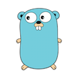

# GopherChat 

> A high-performance, real-time messaging and video calling platform built with Go, Fiber, Gin, WebSocket, WebRTC, and Next.js.

---

## 🚀 Overview

GopherChat is a modern communication platform designed for scalability and low latency. It features instant text messaging, persistent group chats, friend management, and high-quality peer-to-peer video calling.

---

## ✨ Key Features

- **Real-time Messaging:** Instant text delivery via WebSockets
- **Video Calling:**
  - 1-on-1 Peer-to-Peer calls (WebRTC)
  - Group Video Mesh Networking
  - Screen Sharing & Mute Controls
- **Group Chat:** Create public/private groups, manage members, and persistent history
- **Friend System:** Send requests, accept/reject, and see online status
- **Multimedia Support:** Share images and files seamlessly
- **Scalable Architecture:** Microservices-ready design with Redis Pub/Sub

---

## 🛠️ Tech Stack

| Component        | Technology              | Description                                              |
|:-----------------|:------------------------|:---------------------------------------------------------|
| **Frontend**     | Next.js 14, TypeScript  | React-based UI with Tailwind CSS & Framer Motion        |
| **Main Server**  | Go (Gin + Gorilla WS)   | Handles authentication, chat, friends, and database logic|
| **Video Service**| Go (Fiber + WebRTC)     | Specialized microservice for signaling and room management|
| **Database**     | MongoDB                 | Persistent storage for users, messages, and groups       |
| **Cache/PubSub** | Redis                   | Real-time presence, signaling sync, and session management|

---

---
## Architecture
https://github.com/79354/Gopher-chat/blob/main/ARCHITECTURE.md
---

## 🏁 Quick Start

### Prerequisites

- Docker & Docker Compose
- Make (optional, but recommended)

### One-Command Setup 🐳

Run the entire stack (Frontend, Backend, Video Service, DBs) with Docker Compose:

```bash
make up
# OR
docker-compose up --build -d
```

**Access Points:**
- **Frontend:** http://localhost:3000
- **Main Server:** http://localhost:8080
- **Video Service:** http://localhost:4000

### Local Development Setup 💻

If you want to run the services individually for development:

#### 1. Start Databases

```bash
make db-up
```

#### 2. Run Main Server

```bash
cd server
go mod download
go run .
```

#### 3. Run Video Service

```bash
cd video-service
go mod download
go run main.go
```

#### 4. Run Frontend

```bash
cd client
npm install
npm run dev
```

---

## 📚 API Documentation

### Main Server (Port 8080)

#### Authentication
- `POST /register` - Create a new account
- `POST /login` - Authenticate user

#### WebSocket
- `GET /ws` - WebSocket connection endpoint

#### Groups
- `GET /api/groups` - List user's groups
- `POST /api/groups/create` - Create a new group

### Video Service (Port 4000)

#### WebSocket Signaling
- `GET /ws/:roomId` - WebSocket signaling endpoint

#### Room Management
- `POST /api/rooms/create` - Initialize a video session
- `GET /api/rooms/:roomId/participants` - Get active users in a call

---

## 🏗️ Project Structure

```text
GopherChat/
├── 📂 client/                    # Frontend Application (Next.js 14 + TypeScript)
│   ├── 📂 app/                   # App Router (Pages & Layouts)
│   │   ├── 📂 chat/              # Main Chat Route
│   │   ├── globals.css           # Global Tailwind Styles
│   │   └── page.tsx              # Landing Page
│   ├── 📂 components/            # Reusable UI Components
│   │   ├── ChatInterface.tsx     # Main Messaging UI
│   │   ├── VideoCall.tsx         # WebRTC Video Grid & Modal
│   │   ├── VideoControls.tsx     # Mute/Camera/ScreenShare buttons
│   │   └── ...
│   ├── 📂 hooks/                 # Custom Logic Hooks
│   │   ├── useVideoSocket.ts     # Handles Video Signaling Events
│   │   ├── useWebRTC.ts          # Manages Peer Connections & Media
│   │   └── useWebSocket.ts       # Manages Main Chat Socket
│   ├── 📂 lib/                   # API Clients & Utilities
│   ├── 📂 store/                 # State Management (Zustand)
│   ├── Dockerfile                # Frontend Container Config
│   └── package.json              # Dependencies
│
├── 📂 server/                    # Main Backend Server (Go + Gin)
│   ├── 📂 config/                # Database & Environment Configuration
│   ├── 📂 handlers/              # Business Logic & Controllers
│   │   ├── auth_handler.go       # Login/Register Logic
│   │   ├── group_handler.go      # Group CRUD Operations
│   │   ├── lobby.go              # WebSocket Hub (The "Lobby")
│   │   └── ws_handler.go         # Chat WebSocket Upgrader
│   ├── 📂 models/                # MongoDB Data Structures
│   ├── 📂 middleware/            # JWT Auth & CORS Middleware
│   ├── Dockerfile                # Server Container Config
│   └── main.go                   # Application Entry Point
│
├── 📂 video-service/             # Video Microservice (Go + Fiber)
│   ├── 📂 handlers/              # Signaling Logic
│   │   ├── room.go               # Room Management APIs
│   │   └── ws.go                 # WebRTC Signaling WebSocket
│   ├── 📂 models/                # Signaling Payloads (SDP/ICE)
│   ├── 📂 redis/                 # Redis State Management
│   ├── Dockerfile                # Service Container Config
│   └── main.go                   # Application Entry Point
│
├── .env.example                  # Environment Variable Template
├── docker-compose.yml            # Orchestration for All Services
├── Makefile                      # Shortcuts (make up, make logs)
└── README.md                     # Documentation
```

---

## 🤝 Contributing

We welcome contributions! Here's how you can help:

1. **Fork the repository**
2. **Create your feature branch**
   ```bash
   git checkout -b feature/amazing-feature
   ```
3. **Commit your changes**
   ```bash
   git commit -m 'Add some amazing feature'
   ```
4. **Push to the branch**
   ```bash
   git push origin feature/amazing-feature
   ```
5. **Open a Pull Request**

### Development Guidelines

- Follow Go best practices and formatting guidelines
- Write tests for new features
- Update documentation as needed
- Keep commits atomic and well-described

---

**Happy Coding! 🐹**
